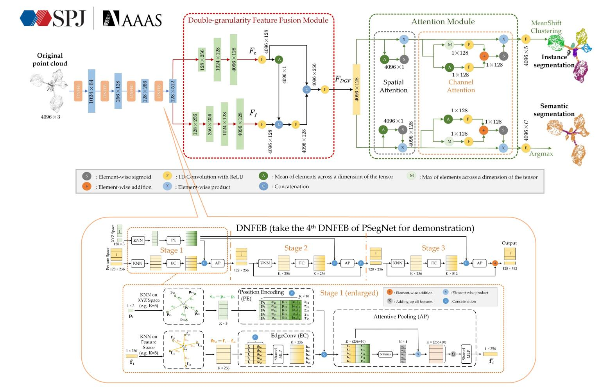
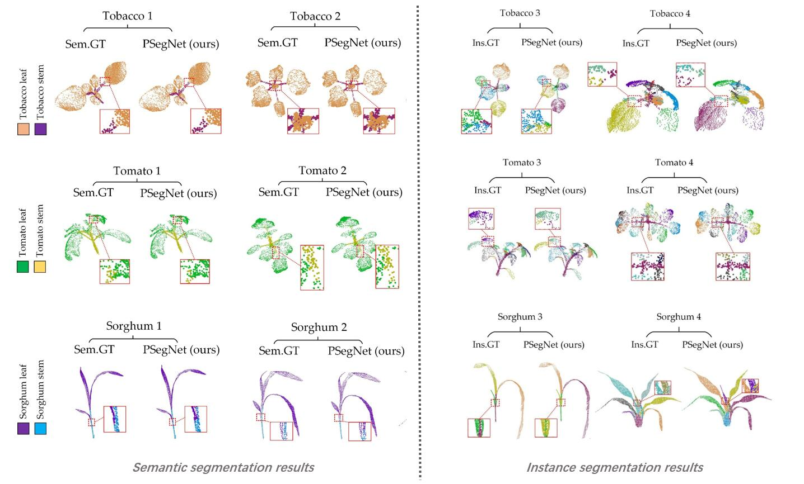
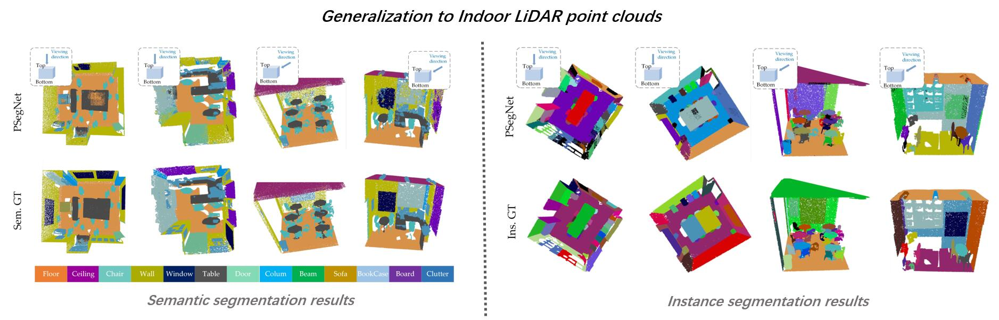
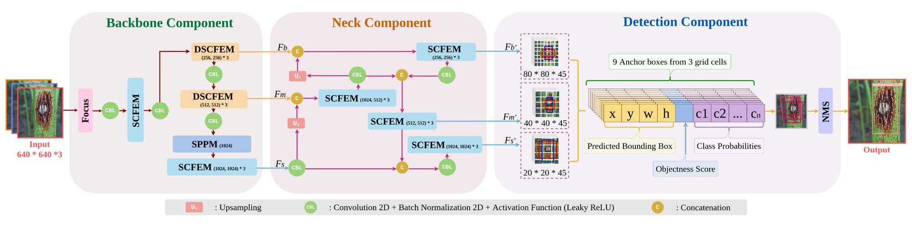
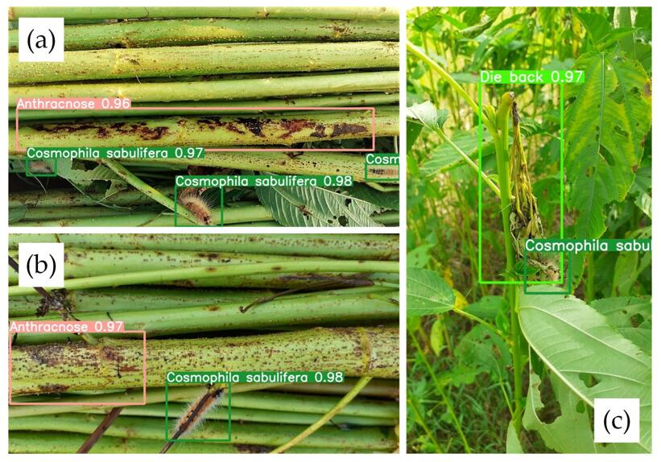

<!-- 注释掉该句# Welcome to Dawei Li's Personal Homepage! -->

<table border="0">
  <tr>
    <td width="100%">
      <h2>Dawei Li 李大威</h2>
      
<b>Associate Professor, PhD</b>

      
<b>Dean of Automation Department</b>

      
<b>I am with the College of Information Sciences and Technology, 
        the State Key Laboratory for Modification of Chemical Fibers and Polymer Materials (SKLFPM), and the Engineering Research Center of Digitized Textile & Fashion Technology of Ministry of Education</b>

      
<b>Donghua University (211, Double First-Class)</b>

      
<b>2999 North Renmin Rd., Songjiang District, Shanghai, China 201620</b>

      
<b>Email: daweili[A.T.]dhu.edu.cn</b>

    </td>
  </tr>
</table>

## Academic History and Education Background:

2018-           Associate Prof., Donghua University, Shanghai, China.

2015-2018  Lecturer, Donghua University, Shanghai, China.

2013-2015  Postdoc, Tongji University, Shanghai, China.

2009-2010  Visiting scholar as jointly trained doctor, MSU, East Lansing, Michigan, USA.

2008-2013  PhD, Tongji University, Shanghai, China.

2006-2008  Graduate student, Tongji University, Shanghai, China.

2002-2006  B.E., Tongji University, Shanghai, China.

<!-- 注释掉该句 
➤ <a href="https://publons.com/researcher/3014495/yinghao-shan"><strong>Publons (peer review records)</strong></a>
  -->

## Research Interests:

Image Processing, Point Cloud Processing, Artificial Intelligence, Intelligent Visual Surveillance, and Plant Phenotyping.

## Teaching:

<i>Semester A (Autumn): </i>

1.	Data Analysis and Machine Learning (for graduate students). 

2.	Pattern Recognition Principles and Techniques (for international students).

<i>Semester B (Spring): </i>

1.	Digital Signal Processing (for undergraduates).

## Research Projects and Talent Programs:

1.	Shanghai Rising-Star Program, Person in Charge. (07/2021-06/2024). 上海市“启明星”人才计划，主持。

2.	“Research on the stereo imaging for plant phenotyping and genotype analysis”, Natural Science Foundation of Shanghai, Person in Charge. (07/2020-06/2023). 上海市自然科学基金面上项目，主持。

3.	“3D imaging for analyzing the phenotypes of textile plants”, The Fundamental Research Funds for the Central Universities of China (special base project), Person in Charge. (01/2019-04/2020)

4.	“Research of illumination-robust stereo vision algorithm for greenhouse plants”, National Natural Science Foundation of China, Person in Charge. (01/2017-12/2019). 国家自然科学基金（青年），主持。

5.	“Digitized imaging and 3D visualization of greenhouse plants”, Shanghai Sailing Program, Person in Charge. (06/2016-05/2019). 上海市青年科技英才“扬帆计划”，主持。

6.	“Research on illumination-robust stereo vision imaging tools for greenhouse plants”, The Fundamental Research Funds for the Central Universities of China, Person in Charge. (01/2016-12/2018)

7.	“A research on digitization and virtual visualization of greenhouse tomato plants”, China Postdoctoral Science Foundation Special Grants, Person in Charge. (07/2014-07/2015). 中国博士后科学基金特别资助，主持。

8.	“Research on key technology in an intelligent video surveillance system”, Shanghai Yangpu District Innovation and Practice base project for postdocs, Person in Charge. (02/2014-12/2014). 

9.	“The research of digitized imaging and virtual visualization technologies on greenhouse plants”, China Postdoctoral Science Foundation 1st class grants, Person in Charge. (07/2013-12/2014). 中国博士后科学基金一等资助，主持。

## Academic Participation:

1.	Chinese Society of Agricultural Engineering, Senior Member.

2.	Chinese Association of Automation, Member

3.	Shanghai Agricultural Engineering Association, Standing Director

4.	IEEE, Member

5.	IEEE CIS Shanghai Chapter, Secretary General

6.	<i>Frontiers in Plant Science</i> (EI/SCI indexed, 2021 IF = 6.627), Review Editor

7.	Reviewer for a number of international conferences and journals including <i>IEEE SPL, IEEE TCSVT, IEEE TMM, IEEE TCYB, IEEE ACCESS, IEEE RA-L, Graphics & Visual Computing, Plant Phenomics, Integrated Computer-Aided Engineering, Neurocomputing, IJPRAI, Applied Engineering in Agriculture (ASABE), Ecological Informatics, The Visual Computer, Automation in Construction, China Communications, International Journal of Remote Sensing, Scientific Programming, NCAA.</i>

## Honors and Awards:

1.	Best Paper Award for Young Researchers at The Annual Academic Conference of Chinese Society of Agricultural Engineering (3/4), Zhenjiang, China. (08/2013)

2.	Best Doctoral Dissertation Award of Year 2013 (Top 28 among 592, 1/1), Tongji University, Shanghai, China. (05/2013)

3.	Finalist for Best Paper Award (Top 6 among 899, 1/3) in the 11th International Conference on Control, Automation, Robotics and Vision (ICARCV2010), Singapore. (12/2010)

## Selected Publications:

[1] <b>D. Li</b>, J. Li, S. Xiang, and A. Pan, “PSegNet: simultaneous semantic and instance segmentation for point clouds of plants,” <i>Plant Phenomics</i>, 2022, Article ID: 9787643.

<table border="0">
  <tr>
    <td width="100%" align="center">
       
    </td>
  </tr>
</table>
<table border="0">
  <tr>
     <td width="55%">
       
    </td>
    <td width="45%">
       
    </td>
  </tr>
</table>

[2] <b>D. Li</b>†, F. Ahmed†, N. Wu, and A. I. Sethi, “YOLO-JD: A Deep Learning Network for Jute Diseases and Pests Detection from Images,” <i>Plants</i>, 2022, vol. 11, no. 7: 937. (†Contributed equally)

<table border="0">
  <tr>
    <td width="100%" align="center">
       
    </td>
  </tr>
</table>
<table border="0">
  <tr>
    <td width="100%" align="center">
       
    </td>
  </tr>
</table>

[3] <b>D. Li</b>†, F. Ahmed†, N. Wu, and A. I. Sethi, “YOLO-JD: A Deep Learning Network for Jute Diseases and Pests Detection from Images,” <i>Plants</i>, 2022, vol. 11, no. 7: 937. (†Contributed equally)

